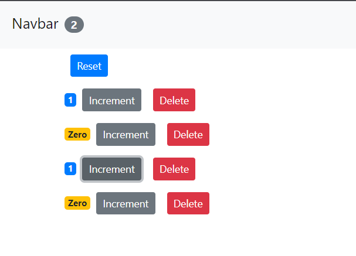

## React Tutorial for Beginners

<!--part 1: ​ Setting Up the Development Environment  -->
### `Class component`

​ Your First React App\
​ Hello World\
​ Components\
​ Setting Up the Project\
​ Your First React Component\
​ Specifying Children\
​ Embedding Expressions\
​ Setting Attributes\
​ Rendering Classes Dynamically\
​ Rendering Lists\
​ Conditional Rendering\
​ Handling Events\
​ Binding Event Handlers\
​ Updating the State\
​ What Happens When State Changes\
​ Passing Event Arguments :
    <!-- Summarry -->
* jsx
* Rendering lists
* conditional rendering
* Passing Data to Components
* Handleding events
* Management State
<!-- part 2 -->
​ Composing Components\
​ Passing Data to Components\
​ Passing Children\
​ Debugging React Apps\
​ Props vs State\
​ Raising and Handling Events\
​ Updating the State\
​ Single Source of Truth\
​ Removing the Local State\
​ Multiple Components in Sync\
​ Lifting the State Up\
​ Stateless Functional Components\
​ Destructuring Arguments\
​ Lifecycle Hooks\
​ Mounting Phase\
​ Updating Phase\
​ Unmounting Phase\
    <!-- Summarry -->
* props
* props vs state
* Raising and handling events
* Lifting the State
*  Multiple Components in Sync
* Functional components
* Lifecycle Hooks

### `Reference`:
- [React JS - React Tutorial for Beginners by Programming with Mosh](https://www.youtube.com/watch?v=Ke90Tje7VS0&t=8013s)